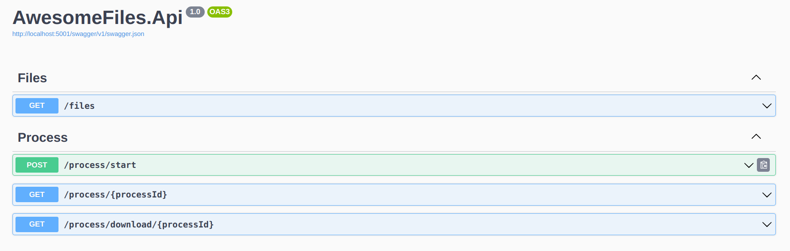
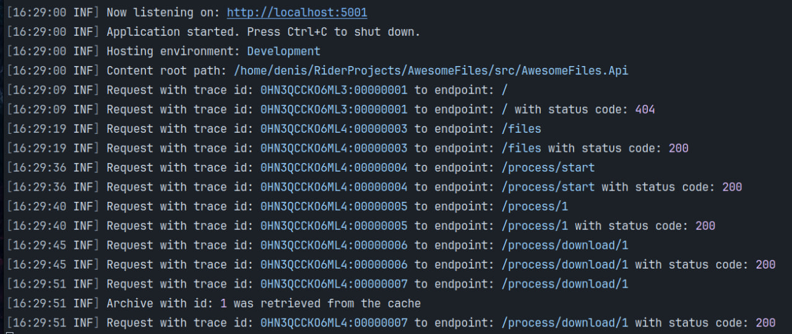
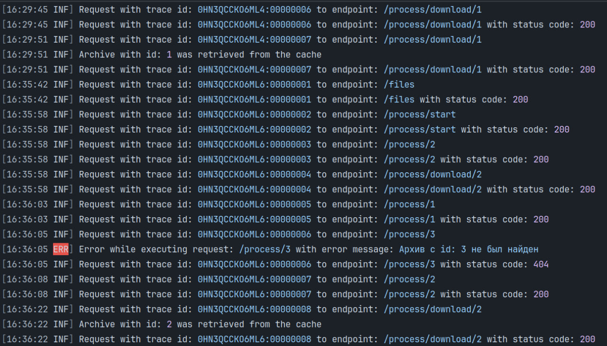
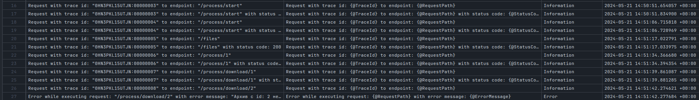

# Мирошниченко Денис

telegram: _@platina_777_

Github: _https://github.com/Platinaa777

## Структура проекта

```bash
├── src                                 # Основной код проекта
│   ├── af                               # Утилита к backend сервису
|   |
│   ├── AwesomeFiles.Api                 # Api приложения (регистрация DI, определение endpoints, 
|   |                                    # middlewares)
|   |
│   ├── AwesomeFiles.Application         # Здесь собраны различные команды и запросы с использованием 
|   |                                    # паттерна проектирования Посредник (Mediator)
|   |                                    # Кеширование происходит на этом уровне в папке Behaviors
|   |
│   ├── AwesomeFiles.Domain              # Домен приложения
|   | 
│   ├── AwesomeFiles.HttpModels          # HTTP модели
|   |
│   └── AwesomeFiles.Infrastructure      # Реализации репозиториев и доменных сервисов
|
├── storage                              # Хранилище
│   ├── archives                         # Здесь хранятся архивы, которые создаются приложением
│   │   ├── archive-1.zip
│   │   └── archive-2.zip
│   └── files                            # Папка с чудесными файлами
│       ├── file1
│       ├── file2
│       └── init-folder
└── tests                                # Папка с тестами
    ├── af.Tests                         # Тесты для утилиты
    ├── AwesomeFiles.Api.Tests           # Тесты для Api
    └── AwesomeFiles.Application.Tests   # Тесты для Application
```

# Утилита af (Приложение 2)

### af - cокращение от AwesomeFiles

## Запуск:

```cs
dotnet af.dll # нужно находиться в src/af/bin/Debug/net7.0
dotnet run    # нужно находиться в src/af

# Можете использовать любой вариант, как Вам удобнее
```

## Описание:

```csharp
Description:
  AwesomeFiles CLI - Консольная утилита для тестирования backend сервиса

Usage:
  af [command] [options]

Options:
  --version       Show version information
  -?, -h, --help  Show help and usage information

Commands:
  auto-create-archive <path> <files>  Режим который самостоятельно запрашивает у backend создание архива, опрашивание о его готовности и скачивание (опрос происходит каждые 200ms)
  create-archive <files>              Создать архив с введеными файлами
  download <taskId> <path>            Скачать архив c id процесса
  exit                                Выйти с приложения
  list                                Показать список всех файлов
  status <taskId>                     Проверить статус процесса

```

## Команды:

```csharp
> auto-create-archive -h
Description:
  Режим который самостоятельно запрашивает у backend создание архива, опрашивание о его готовности и скачивание (опрос происходит каждые 200ms)

Usage:
  af auto-create-archive <path> [<files>...] [options]

Arguments:
  <path>   Путь куда будет скачан архив
  <files>  Файлы которые должны быть архивированы
----------------------------------------------------------------------------------------------
> create-archive -h
Description:
  Создать архив с введеными файлами

Usage:
  af create-archive [<files>...] [options]

Arguments:
  <files>  Файлы которые должны быть архивированы
-----------------------------------------------------------------------------------------------
> download -h
Description:
  Скачать архив c id процесса

Usage:
  af download <taskId> <path> [options]

Arguments:
  <taskId>  Id процесса
  <path>    Путь куда будет скачан архив
------------------------------------------------------------------------------------------------
> exit -h
Description:
  Выйти с приложения

Usage:
  af exit [options]
-------------------------------------------------------------------------------------------------
> list -h
Description:
  Показать список всех файлов

Usage:
  af list [options]
--------------------------------------------------------------------------------------------------
> status -h
Description:
  Проверить статус процесса

Usage:
  af status <taskId> [options]

Arguments:
  <taskId>  Id процесса который надо проверить на готовность

```

## Использование:

```csharp
Запускаем наш backend сервис (после этого запуск утилиты)

❯ dotnet run
> list
GET endpoint: /files response status: OK
file2 file1 
> create-archive file1 file2
POST endpoint: /process/start request status: OK
Создана задача на архивацию, id: 1
> status 1
GET endpoint: /process/1 response status: OK
Задача на архивацию находится в статусе: Pending
> status 1
GET endpoint: /process/1 response status: OK
Задача на архивацию находится в статусе: Completed
> download 1 ./temp
GET endpoint: /process/download/1 response status: OK
File downloaded successfully to ./temp/archive-1.zip

# Авто режим
> auto-create-archive ./temp file1 file2
POST endpoint: /process/start request status: OK
Создана задача на архивацию, id: 1
GET endpoint: /process/1 response status: OK
Задача на архивацию находится в статусе: Pending
GET endpoint: /process/1 response status: OK
Задача на архивацию находится в статусе: Pending
GET endpoint: /process/1 response status: OK
Задача на архивацию находится в статусе: Pending
GET endpoint: /process/1 response status: OK
Задача на архивацию находится в статусе: Pending
GET endpoint: /process/1 response status: OK
Задача на архивацию находится в статусе: Completed
GET endpoint: /process/download/1 response status: OK
File downloaded successfully to ./temp/archive-1.zip
```

## Формат ошибок

```bash
> status 2
GET endpoint: /process/2 response status: NotFound
{"errorMessage":"Архив с id: 2 не был найден"}
-----------------------------------------------------------------------
> download 2 ./temp
GET endpoint: /process/download/2 response status: NotFound
{"errorMessage":"Архив с id: 2 не был найден"}
-----------------------------------------------------------------------
> create-archive file-not-found
POST endpoint: /process/start request status: BadRequest
{"success":false,"body":null,"errors":["File 'file-not-found' does not exists in the system"]}
-----------------------------------------------------------------------
> auto-create-archive ./temp file1 file-not-found
POST endpoint: /process/start request status: BadRequest
{"success":false,"body":null,"errors":["File 'file-not-found' does not exists in the system"]}


```

# Backend сервис (Приложение 1)

## Swagger 



```bash
endpoins:

/files                          - вернуть список всех файлов
/process/start                  - запустить задачу на архивацию коллекции файлов
/process/{processId}            - получить статус задачи (готова или в ожидании)
/process/download/{processId}   - скачать полученную коллекцию
```

## Логирование

Логирую в консоль и в базу данных с помощью Serilog и PostgreSQL провайдера

### Примеры:

#### Консоль





#### В базе данных



## Кеширование

В папке **/src/AwesomeFiles.Application/Behaviors/CacheArchiveBehavior.cs**

```csharp
public async Task<CompletedArchive> Handle(DownloadArchiveQuery request, RequestHandlerDelegate<CompletedArchive> next, CancellationToken cancellationToken)
    {
        // если у нас уже находится в кеше архив, то вернем его
        if (_memoryCache.TryGetValue(request.ProcessId.ToString(), out var archiveBytes)
            && archiveBytes is byte[] bytes)
        {
            _logger.LogInformation("Archive with id: {@Id} was retrieved from the cache",
                request.ProcessId);
        
            return new CompletedArchive(bytes, true);
        }

        var result = await next();

        if (result.IsReady)
            _memoryCache.Set(
                key: request.ProcessId.ToString(),
                value: result.ZipBytes,
                absoluteExpiration: DateTimeOffset.Now.AddMinutes(_cacheOptions.ExpiryTimeInMinutes));

        return result;
    }
```
